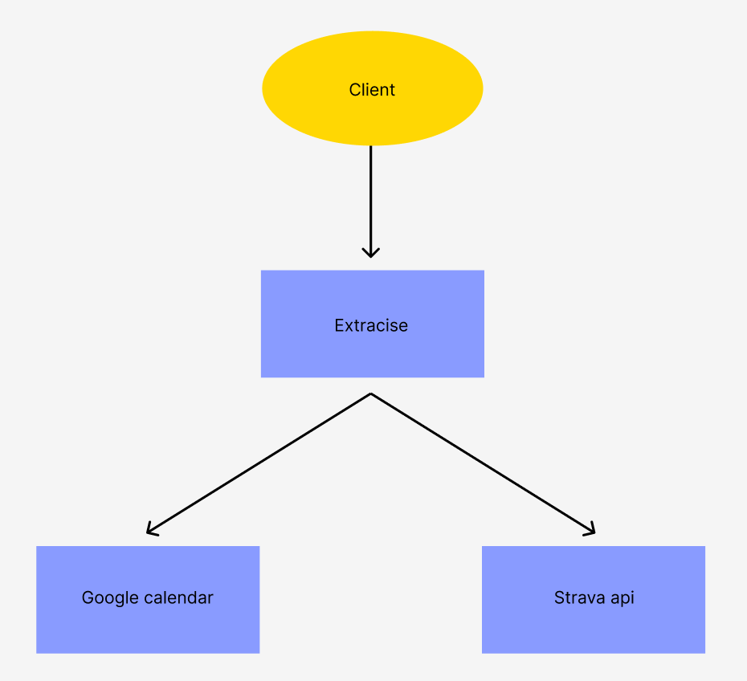
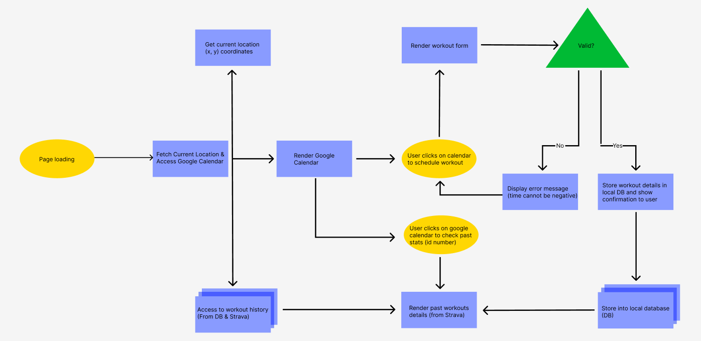

link: https://www.figma.com/file/FkUgTRag6I912bowKIK9jA/DFD-level-0?type=design&node-id=0-1&mode=design&t=TShjKA5u3ArW48uR-0

link: https://www.figma.com/file/fAKfz0IaRu38NM7uY4ozMS/Untitled?type=design&mode=design&t=qS6CSKyCZR5YbiXu-0

The Data Flow Diagram (DFD) provides a visual representation of the data processing within the application. It illustrates how data flows through the system, from the initial page loading to the final storage of workout details in the database. The DFD for this application indicates the logical sequence of steps, such as fetching current location data, accessing workout history, and interacting with Google Calendar and Strava APIs.
