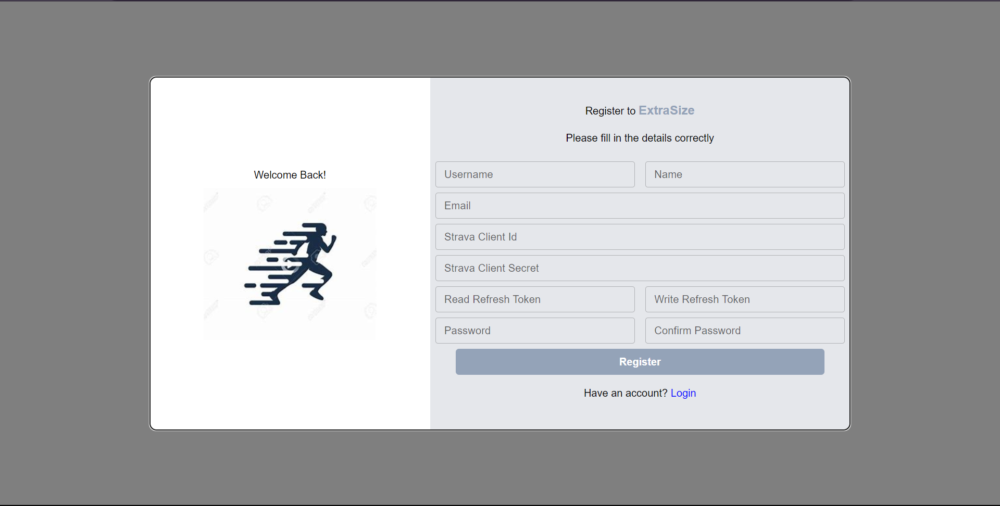

Log in and register interface:

1. Go to .env file (in the server folder) and check the required elements in order to run this app.

2. Create a Strava account to get client ID and secret.

In more detail reference: https://developers.strava.com/docs/getting-started/

3. To get authorized code:
   https://www.strava.com/oauth/authorize?client_id={your_client_id}&redirect_uri=http://localhost&response_type=code&scope=activity:read_all

change {your_client_id} to client ID from account above and visit the web:

Find the code from the web address and copy it.
Auth code=2ea3bb5bb74ccf43f003026778a877c58f1bfd9f

4. Doing the same but change read_all to write:
   https://www.strava.com/oauth/authorize?client_id={your_client_id}&redirect_uri=http://localhost&response_type=code&scope=activity:write

and get the Auth code = c8330981c13ca03c52667c595d2e7b0432906666

5. Install Postman and copy:
   https://www.strava.com/oauth/token? client_id=116661&client_secret=bda2835df4c818bc3611a2ade6c26cb1142b1118&code=2ea3bb5bb74ccf43f003026778a877c58f1bfd9f&grant_type=authorization_code

Read refresh token: 068a3fec7220d26a56bcb86536d4a3650ba2ac67

6. https://www.strava.com/oauth/token? client_id=116661&client_secret=bda2835df4c818bc3611a2ade6c26cb1142b1118&code= c8330981c13ca03c52667c595d2e7b0432906666&grant_type=authorization_code

Write refresh token: 353e5217bfbc397aa6f3c6539f669299a806a3d5

7. replace account’s client ID, refresh token, and client secret from Stava account with .env file.

8. Run the web app and go to register interface:

Enter the info from previous steps to sign up an account.
Google Calendar set up:

1. Watch this YouTube tutorial
   https://www.youtube.com/watch?v=c2b2yUNWFzI&t=2007s
   from 3:49 to 10:11

Please add these ports.

2. Copy client ID and client secret from Additional information the right-side top.
3. Replace those with .env file client ID and client secret.

4. To get the refresh token, running app is needed and can be found from the terminal:

4.1:

4.2:

Copy and paste into the .env file.

Installation:

1. Go to server folder and open terminal:
   npm install

2. Run the server
   npm run dev

3. Go to client folder
   npm install

4. Run the client
   npm run dev

5. Press O once the client runs successfully in order to open web
