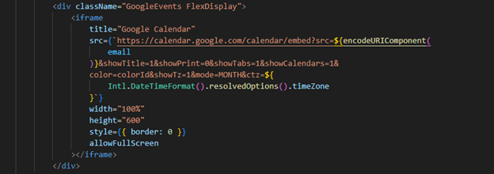
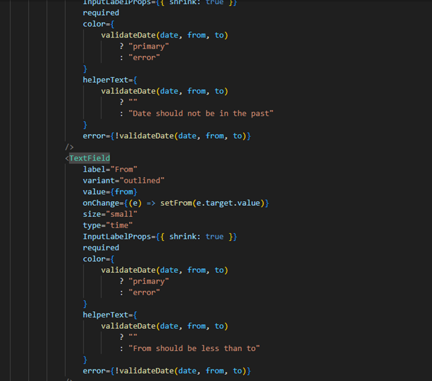

# EXTRASIZE TESTS AND PARTIAL CODES

## UNIT TESTS

### 1. Login

This is the login feature for the application Extrasize. Below is the screen view of how the login modal looks like:

Below is the client-code that renders this view and the logic to validate and send the data input to the backend:

### 2. Register

This is used to add a new user to Extrasize system. Below is a screen view of how the register modal looks like:

Here is the client code that renders this html page, validates the data input and sends to the backend:

### 3. Google Sync(Oauth)

This syncs the calendar with the user’s google account to track the scheduling. Below is the client-view of the section on the html page:

Here’s the client code that renders this html section, extracts data from data fields and sends the data to the backend:

### 4. Map

This displays the distance or place where the workout is to take place. Here’s the screen view of the map on the html page:

### 5. Google Calendar

This displays all the workouts planed in the calendar with the time and name. Here’s the screen view of the html page when synced with google and not synced:

### 6. Workouts

This displays the workouts stored in strava fetched via it’s api. Here’s the screen view of the workout section on the html page:

Below is the client code to generate this view and fetching data:

### 7. Workout scheduling

Editing and scheduling specific times for the workout.

### 8. Calendar scheduling

Schedule the workout times and title. Here’s the screen view of the schedule modal in the html page:

Below is the client code that renders this modal onto the html page:

## Features

### 1. Plan future workouts

In this feature, users can schedule the workouts they intend to perfirm in the future using the schedule form

### 2. Recall of past workouts

In this feature, users get to see your past workouts

### 3. Notification sync

This feature keeps users up on their toes by reminding them via a notification on their device:

### 4. See upcoming workouts

This feature let’s users see the upcoming workouts as planned before on the calendar:

