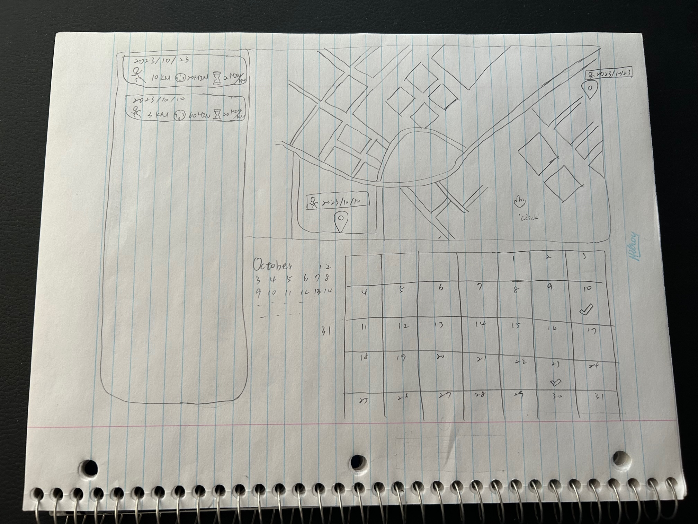
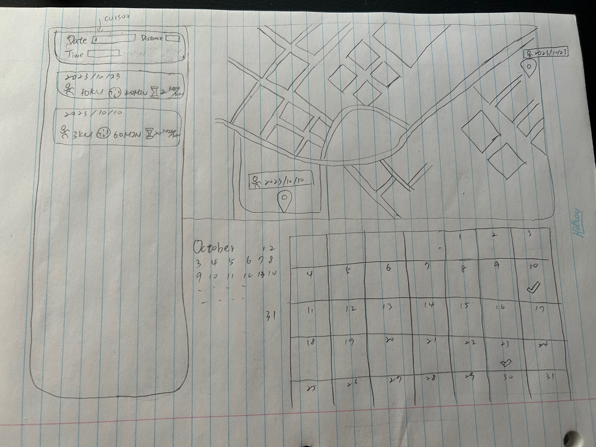
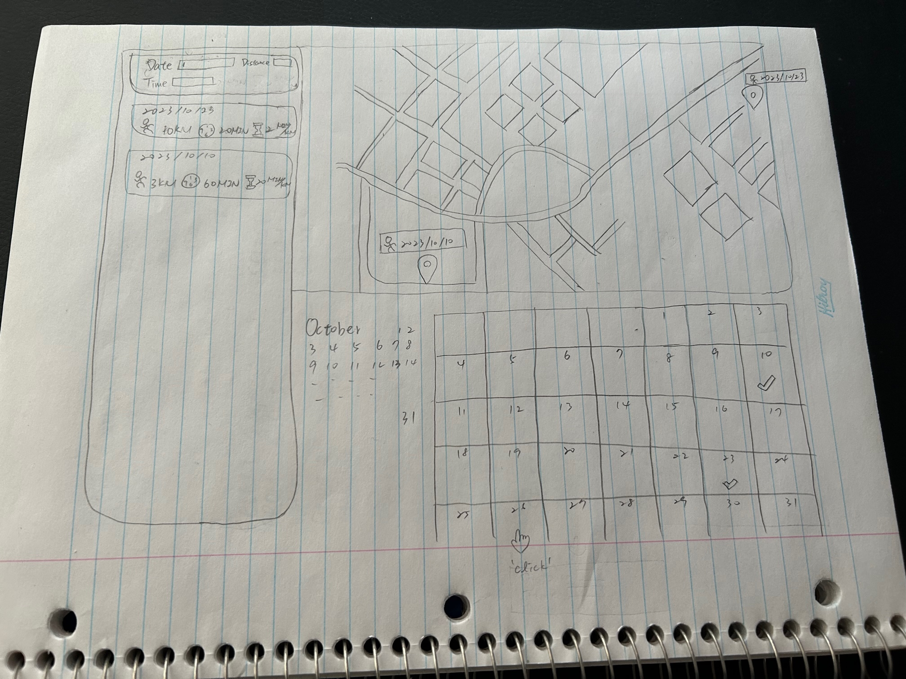
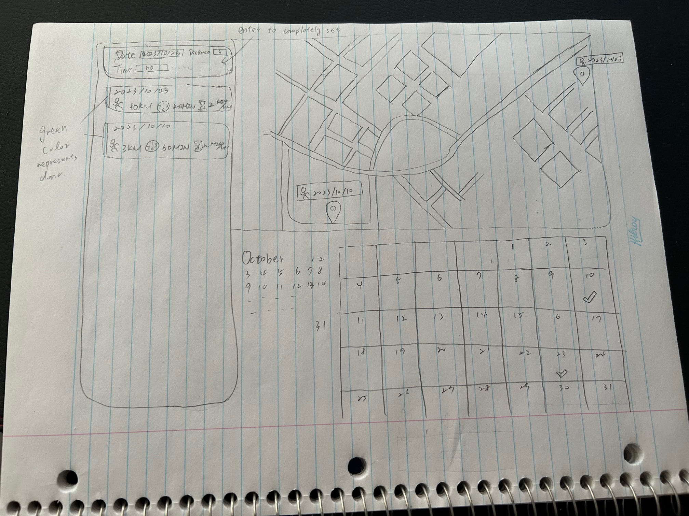
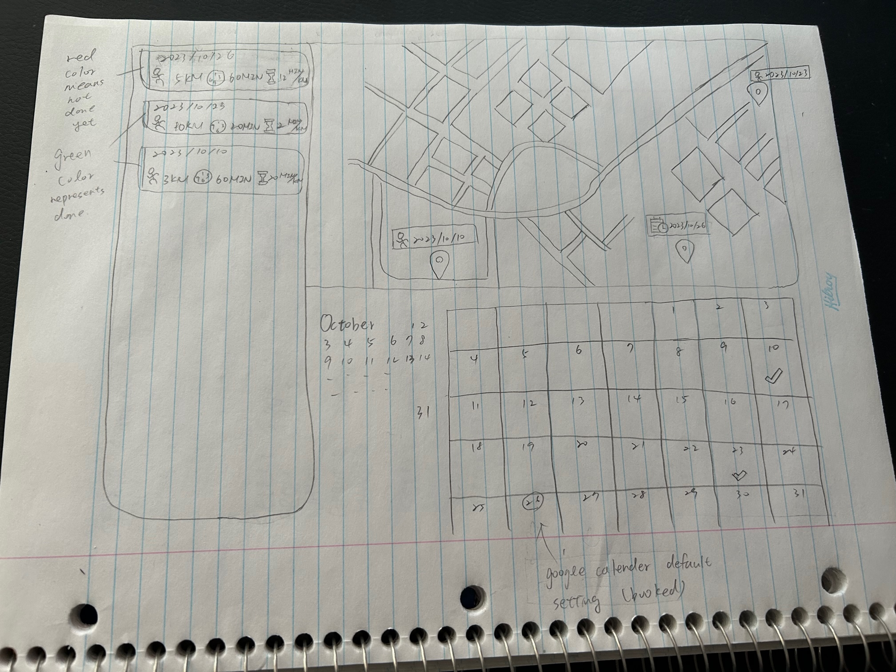
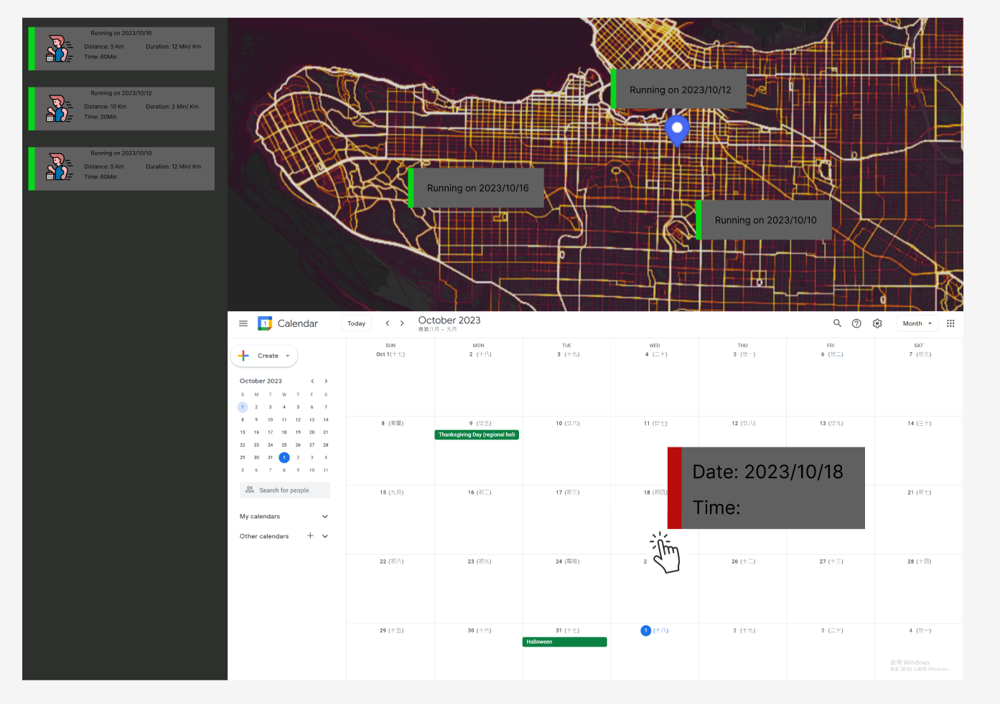

1. project sketch:

a. clicking on the map to trigger setting box

b. setting box shows up and cursor focuses on first date box

c. selecting a date by clicking on Google calender

d. press enter to complete booking

e. showing a certain icon to represnt work-out booking on the map

2. project wireframe:

link: https://www.figma.com/file/BDGzgwGb2XxUYzZwjvgjmm/Untitled?type=design&mode=design&t=qS6CSKyCZR5YbiXu-0

The design indicates functionality that combines activity tracking with calendar management to help users plan and track their running sessions and related activities. The interface employs a clean, inspired by ChatGPT, and structured layout with clear visual markers for ease of use.
