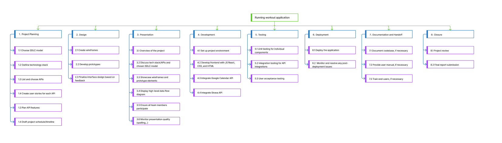

link: https://www.figma.com/file/4TohHkfvQaPGXEWdJI6C33/WBS?type=design&node-id=0-1&mode=design&t=dnVtZdHk1TozyHas-0

For this running workout app, the project is split into eight big steps, like Project Planning, Design, Presentation, and others. Each step has smaller, detailed tasks to make sure every part of the project is covered. This includes choosing how to develop the software, putting the app out for people to use, and writing down how it was made. This careful organization helps keep track of everything and makes the work go smoothly.
